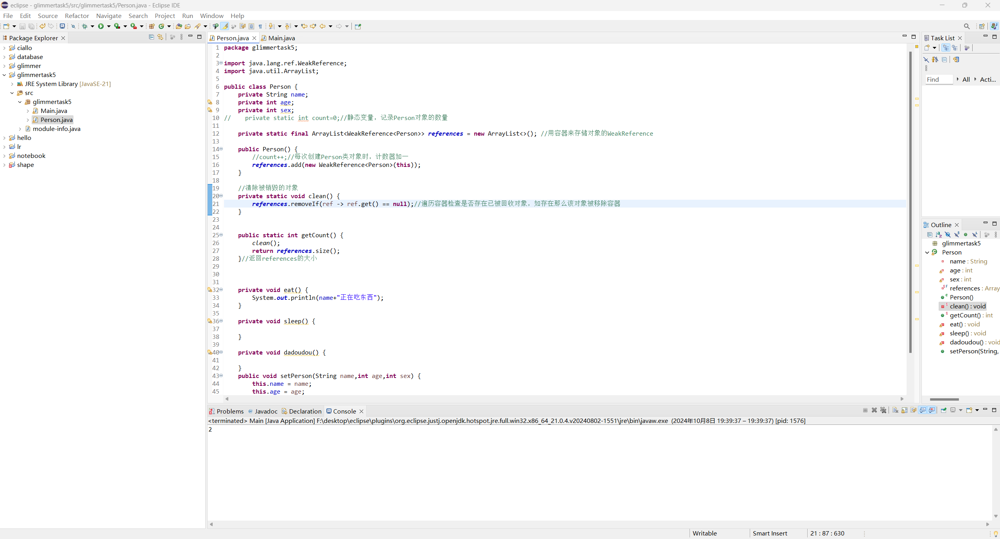
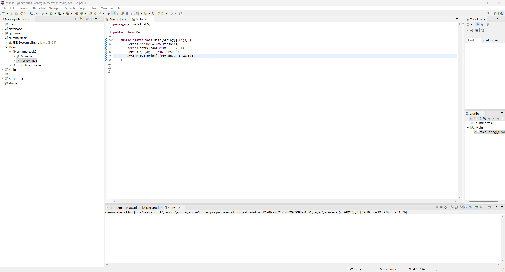

# Glimmer Task 5
## 1.对象和类
**“this”关键字的作用**：
在给Person类添加构造方法实现复制对象时，我们会用到this.name=name类似的写法是为了区分参数name和属性name，你不可能用name=name来写，这样写也不符合常理的  
**对象和类的关系**：
类不包含数据，它更像一种模板、架构，它里面包含了一些属性和方法；而对象是根据类创建的实例，可以储存具体的数据值，是类的具体化。类可以对方法进行封装，通过有限的接口减少类与类之间的耦合性（耦合性越低，说明程序越条理清晰）  
**访问修饰符**：
| Name     | Description |
| ----------- | ----------- |
| 默认（friendly）   | 可以被同一个包中的所有类访问，但是不能被不同包中的类访问      |
| public     | 可以被任何其他类访问       |
| private   | 只能被声明它的类内部访问      |
| protected   |可以被同一个包中的类以及不同包中的子类访问      |
## 2.类中的变量和方法
