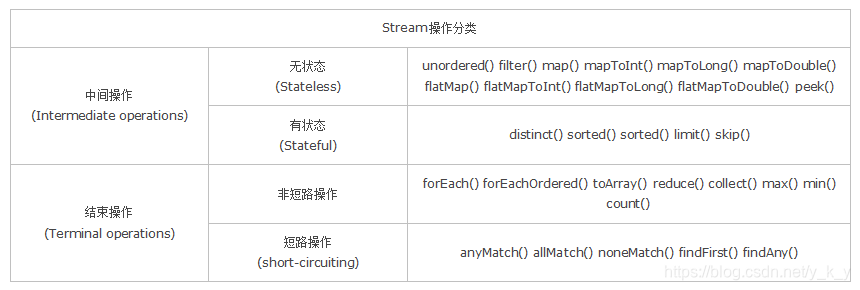
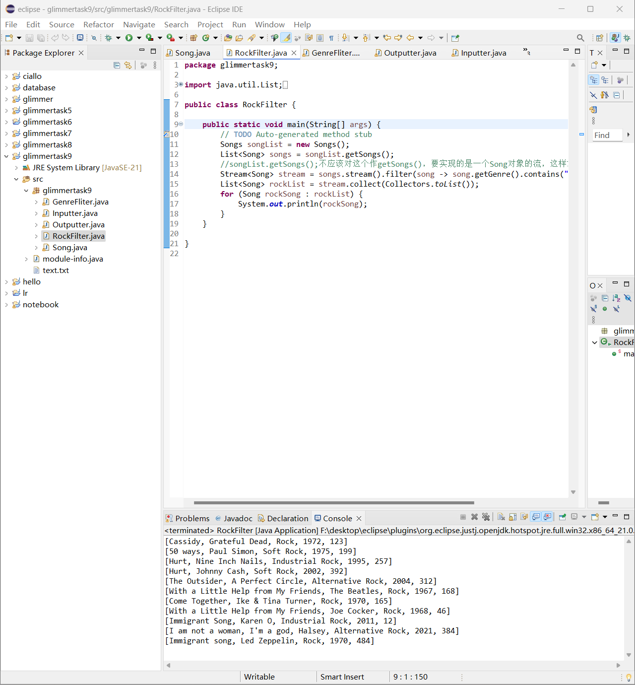
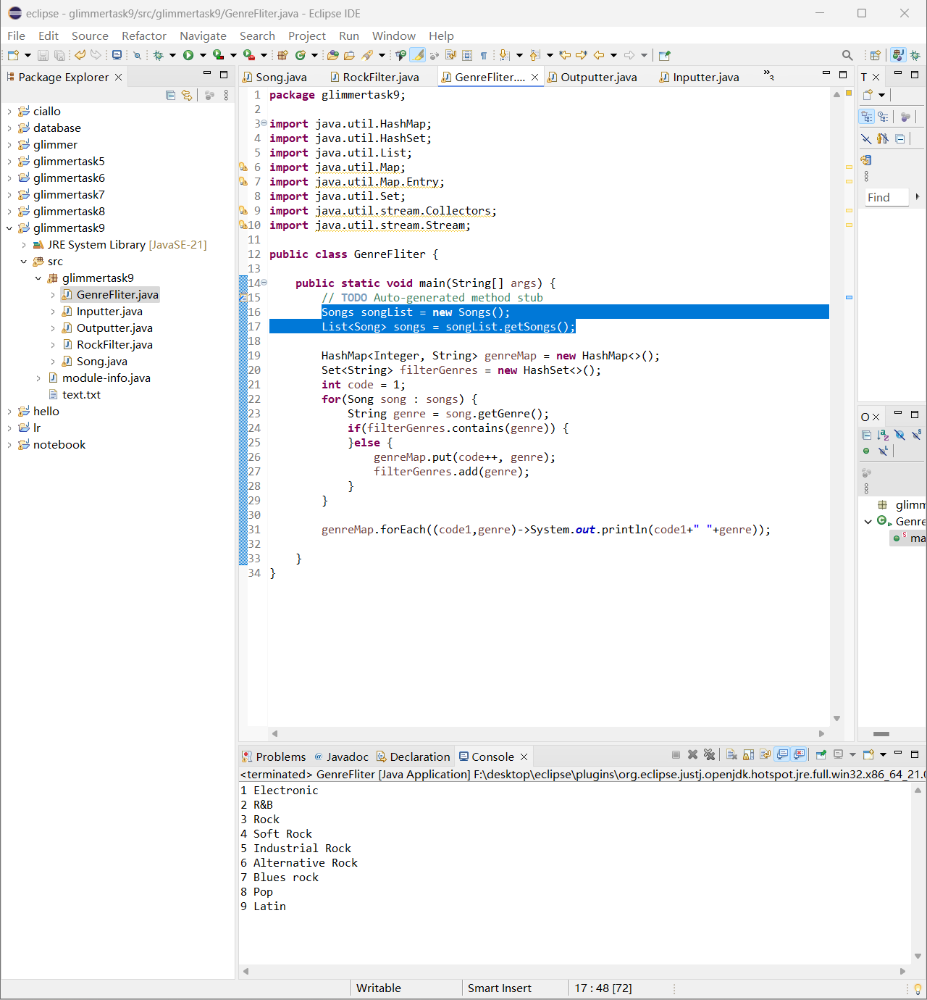
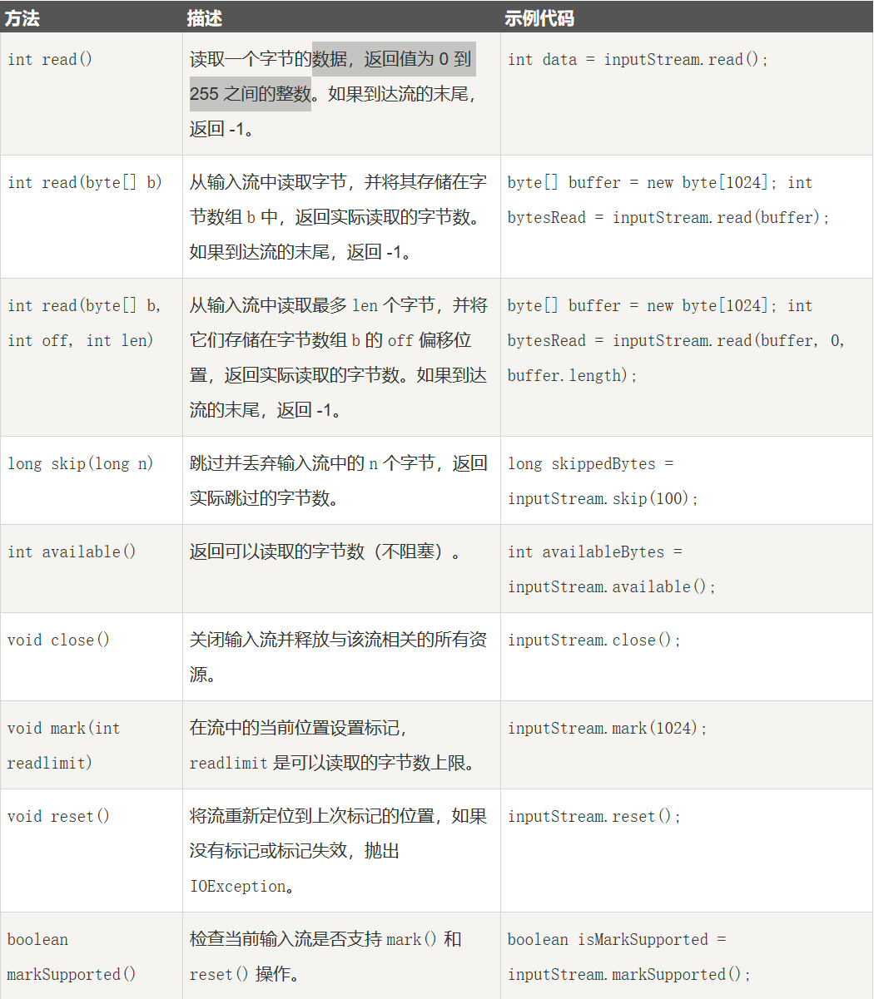
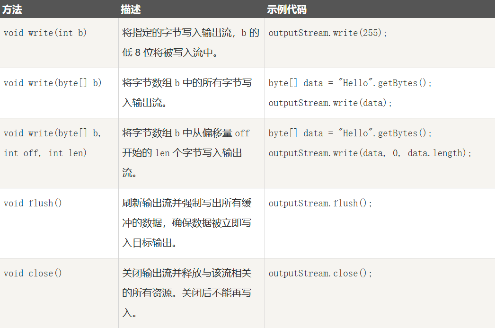
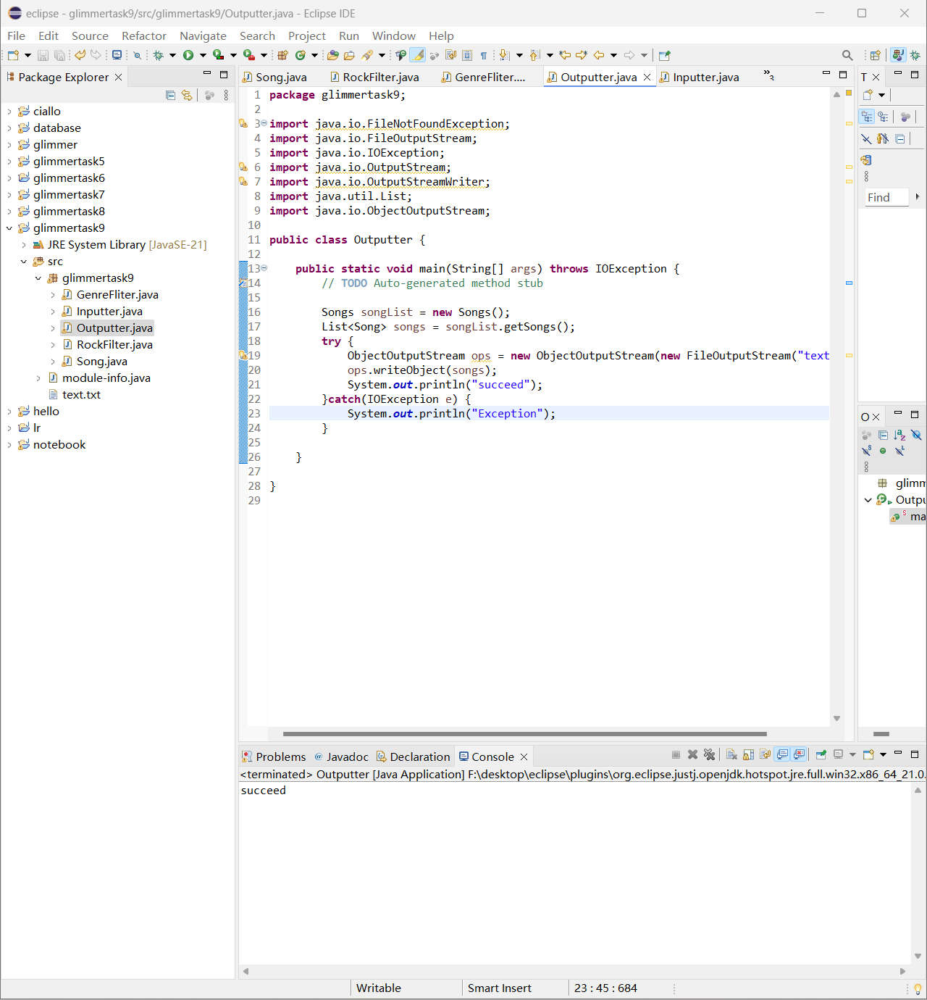
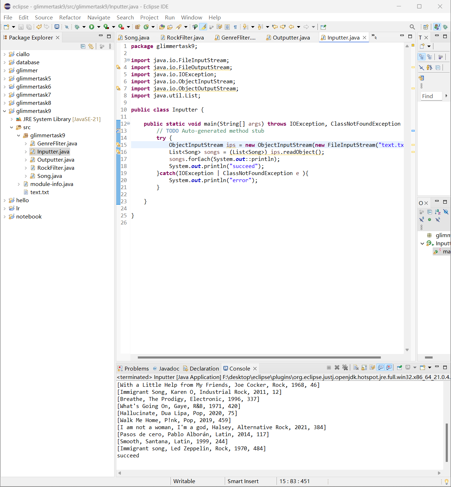
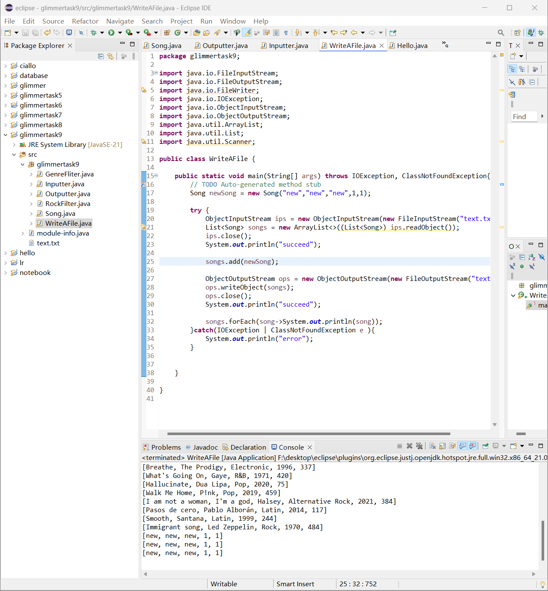

# Glimmertask9

## 流与文件I/O
- 概述：流（Stream），处理集合的抽象概念，可对集合进行查找、过滤、映射数据等操作，类似于数据库SQL语言
- 特点：   
    1. 自生无法储存数据  
    2. 不会修改数据源，它会将操作后的数据保存在另外一个对象中（保留：peek可修改数据源中的元素）
    3. 惰性求值：先记录操作，最后计算
- 分类：

   - 无状态：指元素的处理不受之前元素的影响  
    个人理解：每次调用时，会根据输入产生输出，而不会记住任何历史信息，也不会依赖于外部状态或先前的操作
   - 有状态：指该操作只有拿到所有元素之后才能继续下去  
    个人理解：与无状态相应的，有状态会依赖于或改变外部状态
   - 非短路操作：指必须处理所有元素才能得到最终结果  
    个人理解：处理所有输入元素才能结束，即使某些操作的结果不会影响结果输出
   - 短路操作：指遇到某些符合条件的元素就可以得到最终结果，如 A || B，只要A为true，则无需判断B的结果   
    个人理解：顾名思义，短路就是在非短路操作的基础上，到达某种条件后，中途停止处理元素，会自动“短路”
- 具体用法：  
    1. 创建方法：
        - 使用Collection下的 stream() 和 parallelStream() 方法
            
                List<String> list = new ArrayList<>();
                Stream<String> stream = list.stream(); //顺序流
                Stream<String> parallelStream = list.parallelStream(); //并行流
                //顺序流和并行流可以分别比喻为串联电路和并联电路。串联只能单线程按照顺序依次处理数据，通常对单核处理器和数据较小时使用，避免了多线程编程的一些开销；而并联可以多个处理器核心同时工作，数据较多和计算量较大时使用，但会多出一些线程管理之类的开销
        - 使用Arrays 中的 stream() 方法，将数组转成流
            
                Integer[] nums = new Integer[10];
                Stream<Integer> stream = Arrays.stream(nums);
                //代表Arrays先接收一个数组为参数，再返回一个流
        - 静态方法：of()、iterate()、generate()

                //生成一个包含括号内参数的流
                Stream<Integer> stream = Stream.of(1,2,3,4,5,6);//默认为无状态和非短路的，由上面总结的分类可知：这个流会处理所有元素，且不受之前元素影响

                Stream<Integer> stream2 = Stream.iterate(0, (x) -> x + 2).limit(6);
                stream2.forEach(System.out::println); // 输出“0 2 4 6 8 10”，此时这个流是有状态，非短路的  

                "Stream.iterate"这是一个接受前一个元素并返回下一个元素的函数
                ".limit()"限制流内的数据个数，括号内是对象个数
                
                Stream<Double> stream3 = Stream.generate(Math::random).limit(2);
                stream3.forEach(System.out::println);

                "Stream.generate"一个供应器，每次被调用时都会生成一个新的元素
                "Math::random"随机数，返回一个在区间 [0.0, 1.0) 内的随机数
        
        - 使用 BufferedReader.lines() 方法，将每行内容转成流

                //BufferedReader在前面已经读取文件时使用过，它可以按行读取集合中的文件中的内容
                BufferedReader reader = new BufferedReader(new FileReader("F:\\test_stream.txt"));
                Stream<String> lineStream = reader.lines();//每一行转化为流
                lineStream.forEach(System.out::println);

        - 附：**“System.out.println”和上面的"System.out::println"的区别？**  
        System.out.println 是直接调用方法，而 System.out::println 是方法引用，forEach()中的括号就是对流中对象的操作，就需要引用方法，对流中遍历出来的每个对象进行输出

        - 使用 Pattern.splitAsStream() 方法，将字符串分隔成流

                //识别出所有逗号(,)
                Pattern pattern = Pattern.compile(",");
                //创建一个流并告诉这个流识别出所有逗号并且把它们看作分隔符,将a b c d 四个字母分开
                Stream<String> stringStream = pattern.splitAsStream("a,b,c,d");
                //用System.out::println方法将取出的4个字母遍历并输出
                stringStream.forEach(System.out::println);
        
    2. 流的中间操作：
        - 筛选：  
        filter：过滤流中的某些元素  
        limit(n)：获取n个元素  
        skip(n)：跳过n元素，配合limit(n)可实现分页  
        distinct：通过流中元素的 hashCode() 和 equals() 去除重复元素  
                
                Stream<Integer> stream = Stream.of(6, 4, 6, 7, 3, 9, 8, 10, 12, 14, 14);
                
                //筛选出大于5的元素
                Stream<Integer> newStream = stream.filter(s -> s > 5) //6 6 7 9 8 10 12 14 14
                        //去除重复元素      
                        .distinct() //6 7 9 8 10 12 14
                        //跳过前两个元素
                        .skip(2) //9 8 10 12 14
                        //获取两个元素
                        .limit(2); //9 8
                newStream.forEach(System.out::println);
        - 映射  
        map：接收一个函数作为参数，该函数会被应用到每个元素上，并将其映射成一个新的元素。  
        flatMap：接收一个函数作为参数，将流中的每个值都换成另一个流，然后把所有流连接成一个流。

                List<String> list = Arrays.asList("a,b,c", "1,2,3");
        
                //将每个元素转成一个新的且不带逗号的元素
                Stream<String> s1 = list.stream().map(s -> s.replaceAll(",", ""));
                s1.forEach(System.out::println); // abc  123
                
                Stream<String> s3 = list.stream().flatMap(s -> {
                //将每个元素转换成一个stream
                String[] split = s.split(",");//按逗号分隔字符串
                Stream<String> s2 = Arrays.stream(split);
                return s2;
                });
                s3.forEach(System.out::println); // a b c 1 2 3

        - 排序  
        sorted()：自然排序，流中元素需实现Comparable接口  
        sorted(Comparator com)：定制排序，自定义Comparator排序器

                List<String> list = Arrays.asList("aa", "ff", "dd");
                //String 类自身已实现Compareable接口
                list.stream().sorted().forEach(System.out::println);// aa dd ff
                
                Student s1 = new Student("aa", 10);
                Student s2 = new Student("bb", 20);
                Student s3 = new Student("aa", 30);
                Student s4 = new Student("dd", 40);
                List<Student> studentList = Arrays.asList(s1, s2, s3, s4);
                
                //自定义排序：先按姓名升序，姓名相同则按年龄升序
                studentList.stream().sorted(
                        (o1, o2) -> {
                        if (o1.getName().equals(o2.getName())) {
                                return o1.getAge() - o2.getAge();
                        } else {
                                return o1.getName().compareTo(o2.getName());
                        }
                        }
                ).forEach(System.out::println);

        - 消费    
        peek：如同于map，能得到流中的每一个元素。但map接收的是一个Function表达式，有返回值；而peek接收的是Consumer表达式，没有返回值。

                Student s1 = new Student("aa", 10);
                Student s2 = new Student("bb", 20);
                List<Student> studentList = Arrays.asList(s1, s2);
                
                studentList.stream()
                        .peek(o -> o.setAge(100))
                        .forEach(System.out::println);   
                
                //结果：
                Student{name='aa', age=100}
                Student{name='bb', age=100}    

    3. 流的终止操作      
        - 匹配、聚合操作   
        //这些Match均为boolean类型  
        allMatch：当流中每个元素都匹配时才返回true，否则返回false  
        noneMatch：当流中每个元素都不符合时才返回true，否则返回false  
        anyMatch：只要流中有一个元素满足则返回true，否则返回false  
        findFirst：返回第一个元素  
        findAny：返回任意元素  
        count：返回总个数  
        max：返回最大值  
        min：返回最小值  
        forEach：遍历（常会用于输出）  
        collect：将流转化为其他形式（数组、集合等）  
        close：关闭流

                List<Integer> list = Arrays.asList(1, 2, 3, 4, 5);
        
                boolean allMatch = list.stream().allMatch(e -> e > 10); //false
                boolean noneMatch = list.stream().noneMatch(e -> e > 10); //true
                boolean anyMatch = list.stream().anyMatch(e -> e > 4);  //true
                
                Integer findFirst = list.stream().findFirst().get(); //1
                Integer findAny = list.stream().findAny().get(); //1
                
                long count = list.stream().count(); //5
                Integer max = list.stream().max(Integer::compareTo).get(); //5
                Integer min = list.stream().min(Integer::compareTo).get(); //1

## task 1 流API

        List<String> strings = List.of("I", "am", "a", "list", "of", "Strings");
        Stream<String> stream = strings.stream();
        //调用流API的方法，例如我们希望最多有4个元素
        Stream<String> limit = stream.limit(4);
        //最后我们打印结果
        System.out.println("limit = " + limit);

这段代码会输出：limit = java.util.stream.SliceOps$1@6615435c  
这是一段类名和地址，对于流来说，要进行终端操作，这样才能真正遍历流并处理其中的元素

我以为正确的代码应该为：

        List<String> strings = List.of("I", "am", "a", "list", "of", "Strings");
        Stream<String> stream = strings.stream().limit(4);
        stream.forEach(System.out::println);

这样写就会输出list中前4个元素  
**使用流的规则见上文"流与文件I/O"**

        List<Integer> squaresList = numbers.stream()
                		.map(i -> i * i)        //将流中的每个元素传递给一个映射函数,进行平方运算
                		.sorted((x, y) -> y - x)	//排序，降序排序元素
                		.collect(Collectors.toList());

使用流API的规律：  
1. 创建对象
2. 配置参数
3. 调用API方法（中间操作）
4. 处理结果（结束操作）

### Lambda表达式
语法：实现的这个接口中的抽象方法中的形参列表 -> 抽象方法的处理  

**以下是具体写法**
- 无返回值有形参的抽象方法

        MyInterface myInterface = new MyInterface() {
        @Override
        public void show(int a, int b) {
                System.out.println(a + b);
        }
        };

        myInterface.show(20, 30);//50

        //简写1：方法名可以自己推断出来
        MyInterface myInterface1 = (int a, int b) -> {
        System.out.println(a + b);
        };

        myInterface1.show(20, 40);//60

        //简写2：可以省略形参列表中的形参类型
        MyInterface myInterface2 = (a, b) -> {
        System.out.println(a + b);//70
        };

        myInterface2.show(20, 50);

        //简写3：如果抽象方法中只有一行代码，可以省略方法体的大括号，当然，如果不止一行，就不能省略
        MyInterface myInterface3 = (a, b) -> System.out.println(a + b);
        myInterface3.show(20, 60);//80

        public interface MyInterface {
                public abstract void show(int a,int b);
        }

- 有返回值的抽象方法

        MyInterface1 test1 = new MyInterface1() {
            @Override
            public int test(int a, int b) {
                return a - b;
            }
        };
        System.out.println(test1.test(90, 8));//82

        MyInterface1 test2 = (int a, int b) -> {
            return a - b;
        };
        System.out.println(test2.test(20, 10));//10

        MyInterface1 test3 = (a, b) -> {return a - b;};
        System.out.println(test3.test(30, 10));//20

        //这个有返回值的方法，不能直接去掉大括号，还需要去掉return关键字
        MyInterface1 test4 = (a, b) -> a - b;
        System.out.println(test4.test(40, 10));//30

        public interface MyInterface1 {
                public abstract int test(int a,int b);
        }       

- 如题目中给出的，Lambda表达式可以用于sort方法进行排序

        public static void main(String[] args) {
                Integer[] ints = {89, 67, 23};
                Arrays.sort(ints, (o1, o2) -> o1-o2);
                System.out.println(Arrays.toString(ints));
                //输出[23, 67, 89]
        }

- 注意：Lambda表达式需要函数式接口的支持（函数式接口的定义是: 只包含一个抽象方法的接口，称为函数式接口）（毕竟省略了这么多，肯定不能有两个方法，不然就冲突了()）

## 应用流API

## task 2 串行化
**InputStream**（用于从文件读取数据）：  
1. 如何new一个对象：
   - 可以使用字符串类型的文件名来创建一个输入流对象来读取文件：

                InputStream f = new FileInputStream("C:/java/hello");
   - 可以使用一个文件对象来创建一个输入流对象来读取文件:

                File f = new File("C:/java/hello");
                InputStream in = new FileInputStream(f);

2. 常见方法：  
     

**FileOutputStream**（用来创建一个文件并向文件中写数据）：  
1. 如何new一个对象：
   - 使用字符串类型的文件名来创建一个输出流对象：  

                OutputStream f = new FileOutputStream("C:/java/hello")

   - 使用一个文件对象来创建一个输出流来写文件：  

                File f = new File("C:/java/hello");
                OutputStream Out = new FileOutputStream(f);

2. 常见方法：

附：  
OutputStreamWriter可以使得我们使用字符流的方式写入数据，而实际上数据被编码为字节流  
ObjectInputStream/ObjectOutputStream可以让我们读取和写入像Song这种自定义的复杂类
### Serializable接口
1. 什么是Serializable接口？  
一个对象序列化的接口，一个类只有实现了Serializable接口，它的对象才能被序列化。
2. 什么是序列化？
把对象转换为字节序列的过程称为对象的序列化，把字节序列恢复为对象的过程称为对象的反序列化
3. 什么情况下需要序列化？
当我们需要把对象的状态信息**通过网络进行传输**，或者需要将对象的**状态信息持久化**，以便将来使用时都需要把对象进行序列化

写入写出：

## 文件I/O

 
