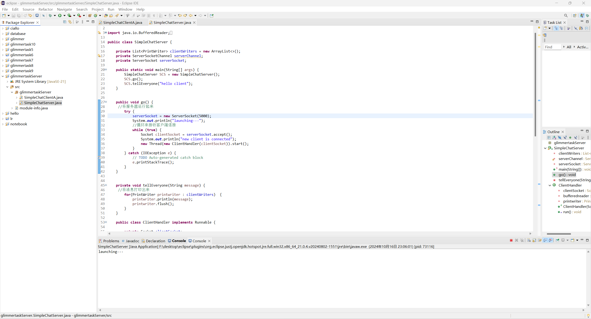
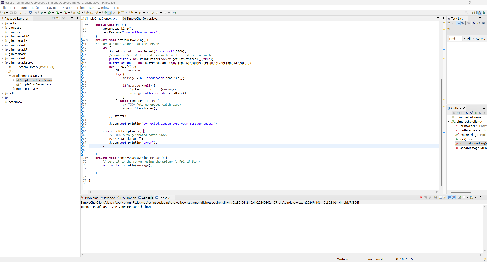
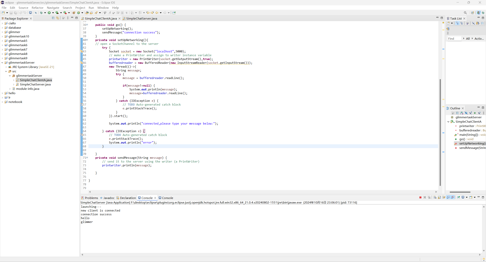

# Glimmertask项目————搭建一个网络服务器
## 建立一个服务器和客户端
    //如何工作
    //服务器创建一个ServerSocketChannel并绑定到一个特定端口
    ServerSocketChannel serverChannel = ServerSocketChannel.open(); 
    serverChannel.bind(new InetSocketAddress(5000));
    //客户端创建一个连接到服务器应用的SocketChannel
    SocketChannel svr = SocketChannel.open(new InetSocketAddress("190.165.1.103", 5000));
    //服务器创建一个新SocketChannel与客户端通信
    SocketChannel clientChannel = serverChannel.accept();

## Java中的Socket编程详解
1. Socket？
Socket是网络编程中必不可少的一部分，它建立在TCP/IP协议上，用于管理连接、传输数据
2. Socket进行工作的原理
    - 通过ServerSocket类创建一个服务器端口，为客户端的连接准备
    - 用Socket类创建客户端并通过端口与服务器
    - 具体操作，数据传输
    - 关闭Socket
3. Socket的基本类
    - ServerSocket：用于在服务器端监听客户端的连接请求  
        - accept()：等待并接受客户端连接（等待连接正常需要通过循环等待客户端连接）
        - close()：关闭服务器端Socket
    - Socket：用于在客户端和服务器端进行通信
        - getInputStream()：获取输入流，从中读取数据
        - getOutputStream()：获取输出流，用于向对方发送数据
        - close()：关闭Socket连接
    - InputStream/OutputStream：用于数据的读取和写入

4. 简单客户端-服务器示例
    - 服务器端代码  

            
            public class Server {
                public static void main(String[] args) {
                    try {
                        // 创建一个监听端口为5000的服务器Socket
                        ServerSocket serverSocket = new ServerSocket(5000);
                        System.out.println("服务器已启动，等待客户端连接...");

                        // 等待客户端连接
                        Socket socket = serverSocket.accept();//socket可以理解为serverSocket接收到的客户端
                        System.out.println("客户端已连接：" + socket.getInetAddress().getHostAddress());

                        // 获取输入流，读取客户端发送的数据
                        BufferedReader reader = new BufferedReader(new InputStreamReader(socket.getInputStream()));//调用socket的getInputStream()方法获得客户端发送的数据，外面再给出一个对输入流的reader，方便获取输入流
                        String clientMessage = reader.readLine();//将reader读到的内容每行存放到clientMessage里面，如果有多个数据，可使用循环，循环至读出来的clientMessage没有内容
                        System.out.println("收到客户端消息：" + clientMessage);

                        // 获取输出流，向客户端发送数据
                        PrintWriter writer = new PrintWriter(socket.getOutputStream(), true);//使用socket的getOutputStream()方法向客户端发送数据
                        writer.println("你好，客户端！");

                        // 关闭资源
                        reader.close();
                        writer.close();
                        socket.close();
                        serverSocket.close();
                    } catch (IOException e) {
                        e.printStackTrace();
                    }
                }
            }
    - 客户端代码

            public class SimpleClient {
                public static void main(String[] args) {
                    try {
                        // 连接到服务器端
                        Socket socket = new Socket("localhost", 5000);
                        System.out.println("已连接到服务器");

                        // 获取输出流，向服务器发送数据
                        PrintWriter writer = new PrintWriter(socket.getOutputStream(), true);//同上
                        writer.println("你好，服务器！");

                        // 获取输入流，读取服务器返回的数据
                        BufferedReader reader = new BufferedReader(new InputStreamReader(socket.getInputStream()));//同上
                        String serverMessage = reader.readLine();
                        System.out.println("收到服务器消息：" + serverMessage);

                        // 关闭资源
                        reader.close();
                        writer.close();
                        socket.close();
                    } catch (IOException e) {
                        e.printStackTrace();
                    }
                }
            }

我写的聊天服务器/客户端：

## 多线程
### 基本知识
1. 进程？线程？
进程可以理解为一个应用程序，而线程可以理解为执行程序的单元。
2. 进程与线程的关系
进程之间相互独立（不共享资源）
线程之间可以通过堆内存和方法区共享内存，但栈内存独立
3. 主栈：
在使用多线程机制时，main方法结束后，只有主线程结束，其他的线程不会被终止
4. 单核CPU可以做到多线程并发：  
单核可以通过“左右横跳”的操作营造出多线程并发的假象
5. 真正的多线程并发：两个线程不会互相干扰和影响
### Java实现
1. 线程构造方法

|方法名||
|---|---|
|Thread()|
|Thread(String name)|给线程命名（如果不给线程命名，他会默认生成递增的编号）|
|Thread(Runnable target)|与Thread()的区别是，这个阐述了这个线程改run哪一个runnable的对象|
|Thread(Runnable target, String name)|                                                                                                                                                                                                                                                                                                                                                                                                                                                                                                                                                                                                                                                                                                                                                                                                                                                                                                                                                                                                                                                                                                                                                                                                                                                                                                                                                                                                                                                                                                                                                                                                                                                                                                                                                                                                                                                                                                                                                                                                                                                                                                                                                                                                                                                                                                                                                                                                                                                                                                                                                                                                                                                                                                                                                                                                                                                                                                                                                                                                                                                                                                                                                                                                                                                                                                                                                                                                                                                                                                                                                                                                                                                                                                                                                                                                                                                                                                                                                                                                                                                                                                                                                                                                                                                                                                                                                                                                                                                                                                                                                                                                                                                                                                                                                                                                                                                                                                                                                                                                                                                                                                                                                                                                                                                                                                                                                                                                                                                                                                                                                                                                                                                                                                                                                                                                                                                                                                                                                                                                                                                                                                                                                                                                                                                                                                                                                                                                                                                                                                                                                                                                                                                                                                                                                                                      
2. 实现方式
    - 编写一个继承Thread的类，重写run  
    eg.

            public class ThreadTest02 {
            public static void main(String[] args) {
                MyThread t = new MyThread();
                // 启动线程
                //t.run(); // 不会启动线程，不会分配新的分支栈。（这种方式就是单线程。）
                t.start();
                // 这里的代码还是运行在主线程中。
                for(int i = 0; i < 1000; i++){
                    System.out.println("主线程--->" + i);
                }
            }
        }

        class MyThread extends Thread {
            @Override
            public void run() {
                // 编写程序，这段程序运行在分支线程中（分支栈）。
                for(int i = 0; i < 1000; i++){
                    System.out.println("分支线程--->" + i);
                }
            }
        }

        注意run和start方法的不同：run方法是调用方法，不会分配新的分支（单线程）；而start会开启一个新的栈空间，开启的空间自动调用run方法

    - 实现Runnable接口，实现run方法  
    .eg

            public class ThreadTest03 {
                public static void main(String[] args) {
                    Thread t = new Thread(new MyRunnable()); 
                    // 启动线程
                    t.start();
                    
                    for(int i = 0; i < 100; i++){
                        System.out.println("主线程--->" + i);
                    }
                }
            }

            // 这并不是一个线程类，是一个可运行的类。它还不是一个线程。
            class MyRunnable implements Runnable {
                @Override
                public void run() {
                    for(int i = 0; i < 100; i++){
                        System.out.println("分支线程--->" + i);
                    }
                }
        }   

3. 更多线程方法

|方法名|作用|
|---|---|
|方法名|作用|
|static Thread currentThread()|获取当前线程对象|
|String getName()|获取线程对象名字|
|void setName(String name)|修改线程对象名字|
|static void sleep(long millis)|让当前线程休眠millis秒|
|void Interrupt()|终止线程休眠|
|void stop()|强制停止线程，可能会导致数据丢失，不推荐使用，正常会使用作bool标记的方法来结束线程|

4. 线程调度方法

|方法名|作用|
|---|---|
|int getPriority()|获得优先权|
|void setPriority(int newPriority)|设置线程优先权|
|static void yield()|线程让位，将一个线程停止，让给其他线程使用|
|void join()|当前线程堵塞，直到加入的线程结束|