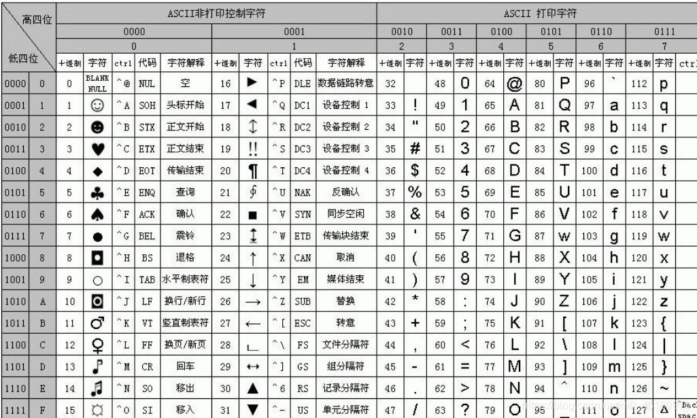

# Glimmer task 3
## 1.变量和数据类型
**八种基本数据类型**：(整型（4种），字符型（1种），浮点型（2种），布尔型（1种）)
| 名字    | 含义 | 字节数 |    表示范围     |
| ----------- | ---------- | -------- | -------- |
|   byte    |    位    |     1      |   -2^7 ~ 2^7-1
|  short  |    短整数     |   2      |  -2^15 ~ 2^15-1
|  int  |    整数     |   4      |  -2^31 ~ 2^31-1
|  long  |     长整数    |  8   |   -2^63 ~ 2^63-1
|  float  |    单精度浮点数     |   4    |  -2^31 ~ 2^31-1
|  double  |    双精度浮点数     |     4     |  -2^63 ~ 2^63-1
|  char  |    字符     |    2      |    0 ~ 2^16-1
|  boolean  |    布尔值（true/false)     |   1    | true、false  

#### 请回答这个过程涉及到的是自动类型转换还是强制类型转换，b的值是多少，为什么会是这个值。  

    int a=4
    char c='0';
    int b=a+c;

1. 是自动类型转换
2. b的值是52，字符是可以与整数型运算的，与整数运算时，字符所带入的值是其对应Unicode表上的数字

根据部分Unicode编码表可知，字符'0'所对应的编码值是48，a+c实际等于4+48，即b=52  

### 拓展

        Integer x = new Integer(18);
        Integer y = new Integer(18);
        System.out.println(x == y);

        Integer z = Integer.valueOf(18);
        Integer k = Integer.valueOf(18);
        System.out.println(z == k);

        Integer m = Integer.valueOf(300);
        Integer p = Integer.valueOf(300);
        System.out.println(m == p);

输出结果：  
**false**//Integer是一个包装类型，它封装了基本数据类型int的值，这段代码中x == y的比较不是值的比较，而是数据存储地址的比较，x，y都是新new出来的包装类型，所以会返回false    
**true**  
**false**//用".valueOf"可以从缓存中返回一个现有的对象，但是它所能承受的范围是-128~127，由给出的代码可知，因为18在这个缓存区间内，所以z和k都指向同一个Integer对象；而300超过了这个范围，所以m，p会指向不同的两个对象，所以地址不同。

## 运算符
  
    int a = 5 ;
    int b = 7 ;
    int c= (++a) + (b++);
    System.out.println( c );
    System.out.println(a+" "+b);
结果：  
13  
6 8  
原因：在自增自减运算中，++a和b++最终的结果都是给a或b加上了1，但是其运算过程是不同的。++a表示先进行自增操作再进行给c赋值，所以++a给c的值是6；而b++表示先进行赋值，再进行自增，所以b++给c的值是7。所以最终c的结果会返回13
### 拓展
    若a=0010（二进制），说出 a&(-a) 的二进制形式是什么。
证：a=0010，-a=1110（a取反再加1）  
0010&1110（相当于逻辑运算的“与”运算）结果是0010  
所以a&(-a)的二进制形式是0010

    对于任意的非负整数a，式子a&(-a)表示的数是什么，为什么得到这个结果（不用严格证明）。
a&(−a)的结果就是a的最低位的1，其他位置全是0。一个二进制数取反后再加一，取反后的数最低位的0只会加一而不会进位，与之相对应的原本的数最低位的1同时为1，作与运算的结果自然是1。  
例如上面的0010，取反后1101，加上1后到倒数第二位不会再继续进位。
